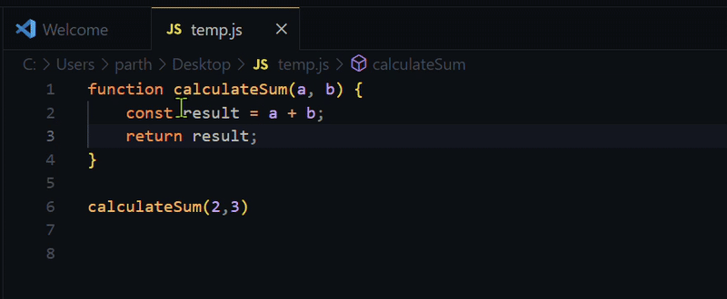

# Console Log with Emoji

Enhance your debugging experience with visual flair! This VS Code extension automatically inserts `console.log` statements with random emojis and filename context.



## Features

✨ **Smart Logging**  
- Press `Alt + P` to insert contextual log statements
- Automatically adds:  
  - Random emoji for visual distinction
  - Current filename for debugging context
- Variable names included when text is selected

🔥 **Intelligent Behavior**  
- Inserts logs on new lines when current line has content
- Maintains proper indentation
- Works with both empty lines and text selections

## Usage

1. Open a JavaScript/TypeScript file
2. Place cursor where you want the log statement
3. Press `Alt + P` to insert:
```javascript
console.log(`🚀 | app.js |`) 
```
Or with selection:
```javascript
console.log(`💡 | auth.js | user: `, user)
```

## Keybindings

| Command | Default Keybinding |
|---------|--------------------|
| Insert log statement | `Alt + P` |

## Emoji Library
Includes 16+ emojis for visual variety:
```
🚀 ✨ 🔥 💡 🌟 ⚡ 🎉 💥 🌈 🐞 🌿 🌊 🪐 🔍 📌 ⚡
```

## Requirements

- VS Code 1.78.0 or later

## Release Notes

### 1.0.0
- Initial release with core features
- Random emoji insertion
- Filename context inclusion
- Smart line insertion logic

## Contributing

Pull requests are welcome! For major changes, please open an issue first to discuss what you would like to change.

## License

[MIT](https://choosealicense.com/licenses/mit/)

**Enjoy!🎉**